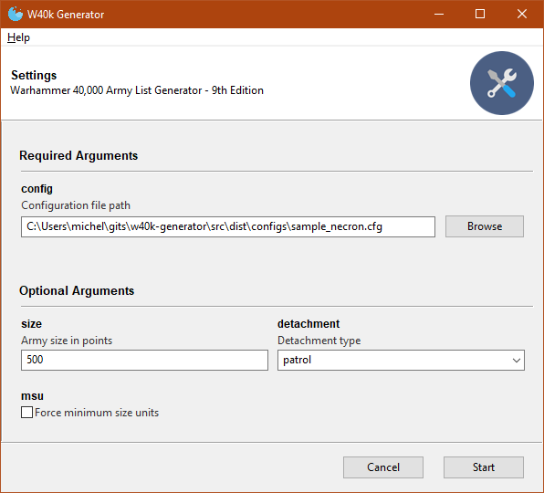
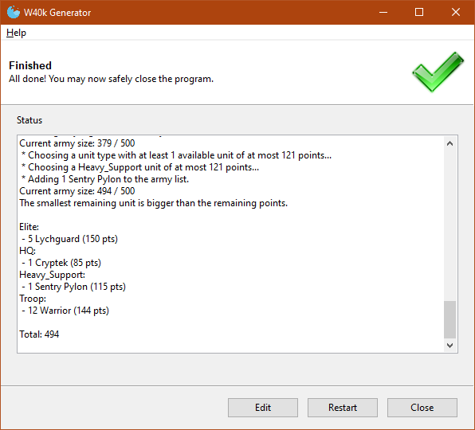

# W40k Army List Generator

Are you:

* Tired of your winning streak?
* Interested in trying combinations you haven't even thought of?
* Looking for non-optimized lists to introduce new players?

If so, then you might be interested in this library! This is a pet project whose purpose is to randomly generate valid lists for Warhammer 40,000's 9th edition, based on your personal model collection. It currently supports:

* Necrons (other factions can be added with ease - see [Codex](#codex));
* Single patrol detachment per list (other detachment types can be added with ease - see [Detachments](#detachments); more than one detachment per list would require some code modification);
* Flexible unit limits for dedicated transports and other special cases (ex.: Necron Cryptothralls) - see [Codex](#codex).

# Content

- [W40k Army List Generator](#w40k-army-list-generator)
- [Content](#content)
- [Under development](#under-development)
- [Installation](#installation)
  - [Basic](#basic)
  - [From source](#from-source)
- [Usage](#usage)
  - [Configuration](#configuration)
- [Codex](#codex)
- [Detachments](#detachments)
- [Philosophy](#philosophy)
- [Contributing](#contributing)

# Under development

* Add named characters to the Necron codex;
* Add more optional preferences (ex.: max units, prioritise painted models, custom percentages, etc.);
* Handle bad configuration (ex.: wrong unit name).

# Installation

## Basic

On Windows 10 64 bits, download and unzip the [latest release](https://github.com/miek770/w40k-generator/releases), then run the executable. On other platforms, you'll need to [install from source](#from-source).

## From source

The following steps assume that you have already have **Python 3.8+** and **Git** installed properly. You might want to create a virtual environment but the steps below assume you don't:

    git clone https://github.com/miek770/w40k-generator.git
    cd w40k-generator
    pip install -r requirements.txt

# Usage

Usage is quite straightforward if you used the [Basic installation](#basic): Simply run the executable (ex.: `w40k-generator-0.1.0.exe`) which opens up this window:



Afterwards, select the desired configuration file and options, and click on `Start` to launch the program. The result should look like this:



If installed from source, usage is slightly more complex. From a terminal (ex.: PowerShell), launch the application with:

    python main.py

...which opens the same windows as the executable.

## Configuration

Your personal collection for a specific faction must be configured in a `configs/<faction>.cfg` file. For example, `configs/sample_necron.cfg` contains my personal collection. To create your own configuration, start by copying the sample:

    cp configs/sample_necron.cfg configs/config_necron.cfg

This file is a [Python configuration file](https://docs.python.org/3/library/configparser.html) structured thusly (lines starting with a `#` are ignore - they are comments):

* **General configuration**: For now, the only variable is `faction`. It ***MUST*** match a codex name (in the `codices` folder), excluding `.cfg`.

> Other codices can easily be created by users - See [Codex](#codex).

```
[General]
faction = necron
```

* **Default values**: Those values are applied to every other section, unless a value is provided.

```
[DEFAULT]
qty = 1
painted = no
proxy = no
proxied_from =
```

> The `painted` option currently has no impact whatsoever.

* **Model configuration**: At least one of these is required per model type in your collection. This is based on the defaults (see **Default values** above); only the values that differ need to be overwritten. For example, leave `qty = 1` out if that's the case for this unit; it already defaults to `1`.

```
[Skorpekh Lord]

[Catacomb Command Barge]
qty = 2
proxy = yes
proxied_from = Annihilation Barge

[Warrior]
qty = 40

[Immortal]
qty = 30
proxy = yes
proxied_from = Warrior, Deathmark
```

# Codex

The units definition for a specific faction must be configured in the `codices/<faction>.cfg` file. Other factions can be added easily by creating the relevant file and referencing it in a configuration file - See [Configuration](#configuration).

For example, `codices/necron.cfg` contains all Necron units, except the named characters (should be added soon). This file is a [Python configuration file](https://docs.python.org/3/library/configparser.html) structured thusly (lines starting with a `#` are ignore - they are comments):

* **Default values**: Those values are applied to every other section, unless a value is provided.

```
[DEFAULT]
ppm = 0
min = 1
max = 1
cat = HQ
units = None
```

* **Unit configuration**: At least one of these is required per unit of this faction. This is based on the defaults (see **Default values** above); only the values that differ need to be overwritten. For example, leave `min = 1` out if that's the case for this unit; it already defaults to `1`.

  The valid values for `cat` (category) are: `HQ`, `Troop`, `Elite`, `Fast_Attack`, `Heavy_Support`, `Flyer`, `Dedicated_Transport`, `Lord_of_War`, `Fortification`, `Other`.

  The `units` option is special; it is by default set to `None`, but setting it to a model name (or a list of names seperated by a `,`) (ex.: `units = Warrior`) tells the program to allow up to one unit of the current model per unit of each of those other units. This is useful for dedicated transports and special cases such as the Necron Cryptothralls.

  The `ppm` option (points per model) is intended to match the cheapest options for this model; one might want to add margin in the configuration file to leave room for more expensive options, or set the `ppm` to the desired default directly in the faction codex file.

```
[Catacomb Command Barge]
ppm = 150

[Warrior]
ppm = 12
min = 10
max = 20
cat = Troop

[Ghost Ark]
ppm = 140
cat = Dedicated_Transport
units = Warrior
```

# Detachments

The **Patrol** and **Battalion** detachments are currently supported (only 1 detachment per army list).

The detachments definition are located in the `army.py` file, and referenced in the `main.py` file. Please open an issue if you wish for additional detachment options, or propose a pull request.

# Philosophy

Well, *philosophy* might not be the right term, but here is how the library builds a list:

* Set your `codex`, `collection` and `army` up based on the relevant configuration;
* Meet the detachment's minimum requirements (ex.: for a patrol detachment, add an HQ and a troop);
* Until either the army is full or there is no valid unit remaining:
  * Roll a ***valid*** unit type from your collection;
  * Roll a ***valid*** unit of that type;
  * Add that unit to your army, and remove the models from your collection:
    * If `msu` is enforced, add/remove the minimum amount of models to form this unit;
    * Check for and handle proxies;
    * Otherwise, add/remove the minimum amount 50% of the time, and add/remove a random amount between the minimum and either the maximum or the remaining models the rest of the time.

The term ***valid*** is a bit vague, but the relevant checks are performed. For a unit:

* Are there sufficient models to build a `msu` (minimum size unit)?
* Does the `msu` cost less than the remaining points?

> The cheapest options are intented to be entered in each faction codex file; one might want to add margin in the configuration file to leave room for more expensive options, or set the `ppm` (points per model) to the desired default directly in the faction codex file.

For a unit type:

* Are all slots for this unit type in this detachment already taken?
* Is there at least one valid unit remaining in this unit type?

# Contributing

All contributions are welcome. I don't intend to support any other codex than the Necrons', but others are more than welcome to jump in and I'll be happy to help.
